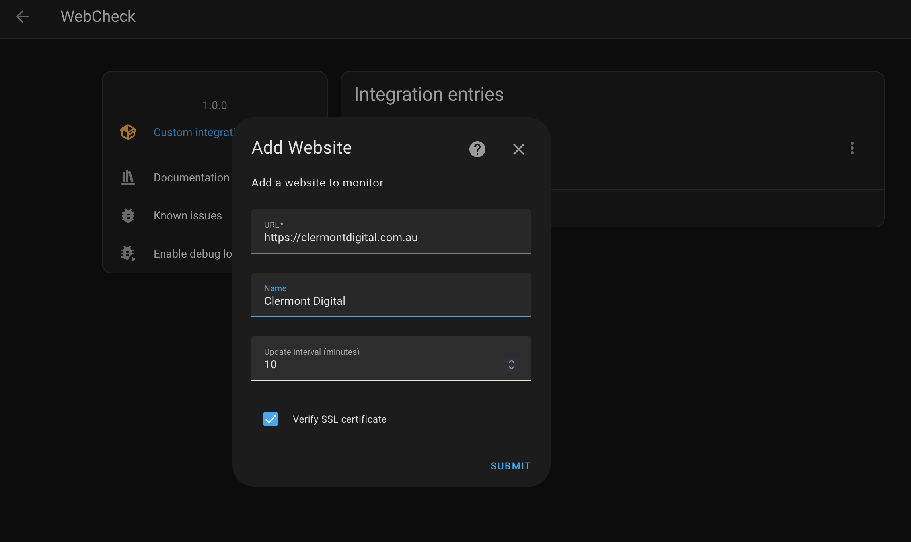
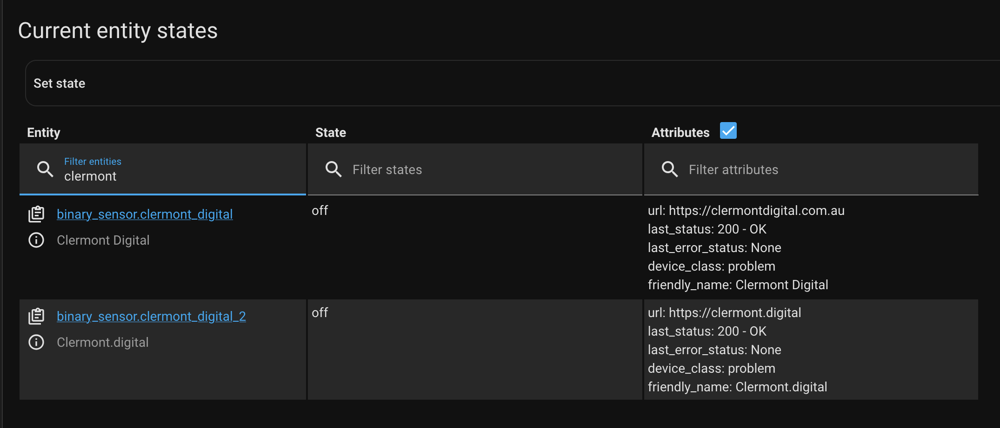

# WebCheck

Custom integration that checks if a website is reachable or not.

A website is considered OK when an HTTP request returned with a response code < 500.
Or the other way around it is considered a problem if the HTTP request failed or returned a response code >= 500.

This integration is a fork of [Websitechecker](https://github.com/mvdwetering/websitechecker) with enhanced functionality to add websites as devices through the UI.

## Features

- Add websites to monitor directly through the Home Assistant UI
- Each website is represented as a device in Home Assistant
- Monitor website availability with binary sensors
- Configure update intervals and SSL verification per website

The sensor offers the following additional attributes:

* url: The configured URL for this sensor
* last_status: Status of last update. Some possible values are "200 - OK" or "Connection error". More error values exist.
* last_error_status: Status of last error, allows to easily see what the last issue was if it came back already.

## Screenshots

### Adding a Website


### WebCheck Integration Page


### Website State Information


## Installation

### Home Assistant Community Store (HACS)

*Recommended as you get notifications of updates*

HACS is a 3rd party downloader for Home Assistant to easily install and update custom integrations made by the community. More information and installation instructions can be found on their site https://hacs.xyz/

* Add this repository https://github.com/developersteve/webcheck to HACS as a "custom repository" with category "integration". This option can be found in the ⋮ menu
* Install the integration from within HACS
* Add the integration through the Home Assistant UI under "Configuration" -> "Integrations"
* Restart Home Assistant

### Manual

* Extract the Zip file in the `custom_components` directory
* Restart Home Assistant
* Add the integration through the Home Assistant UI under "Configuration" -> "Integrations"

## Configuration

### UI Configuration (Recommended)

1. Go to "Configuration" -> "Integrations" in the Home Assistant UI
2. Click the "+ Add Integration" button
3. Search for "WebCheck" and select it
4. Enter the URL of the website you want to monitor
5. Optionally provide a custom name, update interval, and SSL verification setting
6. Click "Submit"
7. Repeat steps 2-6 for each website you want to monitor

### YAML Configuration (Legacy)

```yaml
webcheck:
  websites:
    - url: https://example.com
      name: Optional friendly name
    - url: http://does_not_exist.com
    - url: http://192.168.178.4:9000  # URLs with non-standard ports also work
```

Advanced configuration:

```yaml
webcheck:
  update_interval: 10  # Optional, value in minutes, defaults to 10
  websites:
    - url: https://example.com
      name: Optional friendly name
      verify_ssl: false  # Optional, default is true
    - url: http://does_not_exist.com
      update_interval: 5  # Optional, main `update_interval` used when not provided
```

## Notifications

Because the integration exposes normal sensors you can use Automations to get notified of issues. These type of automations are not specific for this integrations, so you can build automations as usual. 

### Example Automation for Website Status Change Notifications

This example automation will send a notification to your mobile device when a monitored website changes status (either goes down or comes back up):

```yaml
automation:
  - alias: "Website Status Change Notification"
    description: "Send notification when a website status changes"
    trigger:
      - platform: state
        entity_id: binary_sensor.home_assistant_website
    condition: []
    action:
      - service: notify.mobile_app_your_phone
        data:
          title: "Website Status Change"
          message: >
            Website: {{ trigger.to_state.attributes.url }} 
            Status: {{ trigger.to_state.attributes.last_status }}
            
            ⚠️ Website is DOWN
            
            ✅ Website is UP
            
          data:
            # Optional: Add additional data for rich notifications
            clickAction: /lovelace/devices
```

You can customize this automation to fit your needs, such as:
- Only notify when the website goes down (add a condition to check if `trigger.to_state.state == 'on'`)
- Include more information from the entity attributes
- Send notifications through different services (email, Telegram, etc.)
- Trigger other actions like turning on a light or playing a sound

Below are some links to related Home Assistant documentation.

* [Automating Home Assistant](https://www.home-assistant.io/docs/automation/)
* [Home Assistant Mobile App notifications](https://companion.home-assistant.io/docs/notifications/notifications-basic)
* [Notification Blueprints on Home Assistant forums](https://community.home-assistant.io/search?q=notifications%20%23blueprints-exchange)
* [Home Assistant Core integrations that support notifications](https://www.home-assistant.io/integrations/#notifications)

When you have questions for automations or looking for examples ask/search on one of the Home Assistant Community channels like [Forum](https://community.home-assistant.io/), [Discord](https://www.home-assistant.io/join-chat) or [Reddit](https://reddit.com/r/homeassistant).
